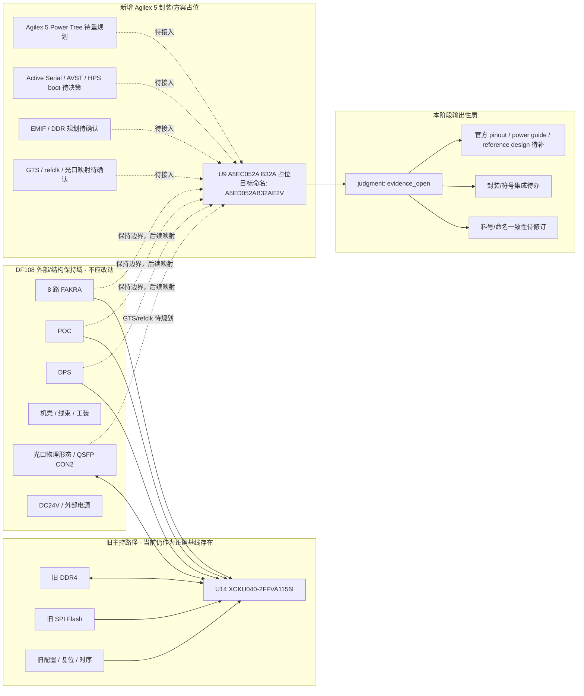

# New Architecture - Current Agilex Package Placeholder

本图描述当前输入的“新架构占位状态”：在既有正确旧图基础上新增 Agilex 5 芯片封装/方案占位，但还不是完整的 KU040 -> A5ED052AB32AE2V 迁移签核图。

## Evidence Anchors

| 对象 | 证据 |
|---|---|
| 旧主控仍在当前输入中 | BOM: `U14 = XCKU040-2FFVA1156I` |
| 新增 Agilex 占位 | BOM/PST: `U9 = A5EC052A B32A` |
| 目标名称 | 用户任务描述：`A5ED052AB32AE2V` |
| C/D 封装关系 | 用户补充：C 型和 D 型封装统一，名称后续再改 |
| 当前判断口径 | `run-20260507-judgment-v2/judgment_interpretation.md` |

## Diagram

## 解释

- 当前“新架构”不是一个完成迁移的电气闭环架构，而是新增 Agilex 5 封装/方案占位。
- `U9` 的 `A5EC` 名称在当前阶段按占位处理；正式输出前必须改成最终约定的 `A5ED052AB32AE2V` 相关名称，并重新导出 BOM/PST。
- `U14 KU040` 仍在输入中，因此工具看到的旧路径和新占位会共存；审核应先判断边界和占位状态，不应直接按发板前 sign-off 口径判错。
- 本阶段的合理结论是 `evidence_open`：证据和集成待办未闭合。
