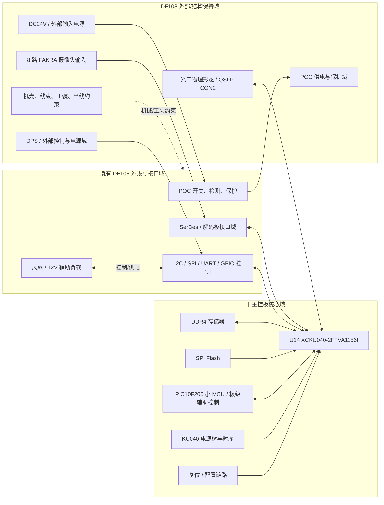

# Old Architecture - KU040 Baseline

本图描述“旧架构 / 既有正确原理图基线”的系统视角。它不是从网表自动完整还原的全部电路，而是基于当前输入证据和任务边界整理出的审核用架构图。

## Evidence Anchors

| 对象 | 证据 |
|---|---|
| 主 FPGA | BOM: `U14 = XCKU040-2FFVA1156I` |
| 光口物理连接器 | BOM: `CON2 = QSFP` |
| DDR | PST: `DDR4-16-96P` primitive |
| SPI Flash | PST: `FLASH-SPI-9P` primitive |
| 小 MCU | BOM / PST: `PIC10F200` / `MCU-10F200` |
| 外设保持域 | 用户任务描述：8 路 FAKRA、POC、DPS、机壳、光口物理形态保持 |

## Diagram

## 解释

- 旧架构的中心是 `U14 XCKU040-2FFVA1156I`。
- 外设域是本次衍生机型的保持对象，不应因主芯片替换而破坏。
- DDR、Flash、复位、配置、电源树都围绕 KU040 形成旧主控域。
- 当前审核不应把旧架构中的外部输入、POC、DPS、测试点策略自动判成错误；这些需要和正式旧图基线、接口约束一起判断。
