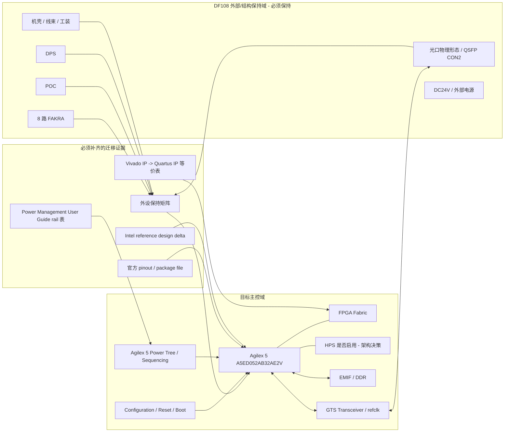

# Target Architecture - A5ED052AB32AE2V Migration Intent

本图描述后续正式迁移完成后应验证的目标架构。它是“目标审核框架”，不是当前输入已经完成的原理图事实。

## Diagram

## 正式审核条件

- `U9` / BOM / PST / symbol value 已统一为最终目标料号或项目认可的规范名称。
- 官方 pinout、power rail、sequencing、configuration、boot、HPS、transceiver、DDR/EMIF 证据已进入 `02_design_evidence/`。
- 外设保持矩阵证明 8 路 FAKRA、POC、DPS、机壳、光口物理形态未被破坏。
- 再运行完整迁移专项审核，才能把结果用于发板或正式冻结 gate。
